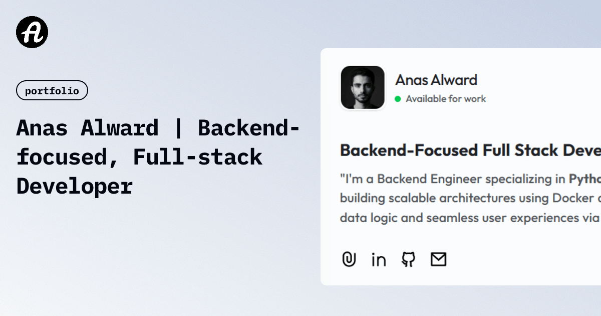

# 🌐 Interactive 3D Portfolio

A premium, high-performance personal portfolio built with **React 19**, **Vite**, **Tailwind CSS 4**, and **Three.js**. This project features a dynamic, data-driven architecture powered by **Supabase**, offering a seamless blend of interactive 3D graphics and clean, modern UI.

 *(Note: Add a real preview image to public/preview.png or update this link)*

## ✨ Key Features

- **🎨 3D Hero Experience**: An immersive landing section powered by **Three.js** and **Framer Motion**, delivering a state-of-the-art visual first impression.
- **🔄 Supabase Integration**: Completely dynamic content! Manage projects, work history, skills, and testimonials directly from your Supabase dashboard.
- **📱 Responsive & Premium UI**: Built with **Tailwind CSS 4** for a high-end look and feel that works perfectly on any device.
- **📂 Multi-Section Tabs**: Intuitive navigation through Projects, Experience, Education, Certificates, Achievements, and more.
- **🔍 Auto-SEO & Dynamic Favicon**: The application automatically generates SEO meta tags and a circular favicon based on your Supabase profile data.
- **⚡ Performance First**: Optimized using **Vite**, **React Query (TanStack Query)**, and **React 19**'s latest features for lightning-fast load times.

## 🛠️ Tech Stack

- **Core**: [React 19](https://react.dev/), [TypeScript](https://www.typescriptlang.org/), [Vite](https://vitejs.dev/)
- **Visuals**: [Three.js](https://threejs.org/), [@react-three/fiber](https://github.com/pmndrs/react-three-fiber), [Framer Motion](https://www.framer.com/motion/)
- **Styling**: [Tailwind CSS 4](https://tailwindcss.com/)
- **Backend & CMS**: [Supabase](https://supabase.com/) (PostgreSQL & Storage)
- **Data Management**: [TanStack Query v5](https://tanstack.com/query/latest)
- **Icons**: [Lucide React](https://lucide.dev/)
- **Deployment**: [Cloudflare Pages](https://pages.cloudflare.com/) via [Wrangler](https://developers.cloudflare.com/workers/wrangler/)

## 🚀 Getting Started

### Prerequisites

- [Node.js](https://nodejs.org/) (latest LTS recommended)
- [Bun](https://bun.sh/) (optional, but used in deployment scripts)
- A [Supabase](https://supabase.com/) account and project.

### Installation

1. **Clone the repository**:
   ```bash
   git clone <your-repo-url>
   cd basic-portfolio
   ```

2. **Install dependencies**:
   ```bash
   npm install
   # or
   bun install
   ```

3. **Configure Environment Variables**:
   Create a `.env` file in the root directory (use `.example.env` as a template):
   ```env
   VITE_SUPABASE_URL=your_supabase_project_url
   VITE_SUPABASE_ANON_KEY=your_supabase_anon_key
   VITE_USER_ID=your_profile_id_in_supabase
   ```

4. **Launch Development Server**:
   ```bash
   npm run dev
   # or
   bun run dev
   ```

## 📦 Deployment

This project is configured for deployment on **Cloudflare Pages** using Wrangler.

1. **Build the project**:
   ```bash
   npm run build
   ```

2. **Deploy via Wrangler**:
   ```bash
   npm run deploy
   ```

---

*Developed with ❤️ by Anas Alward*
